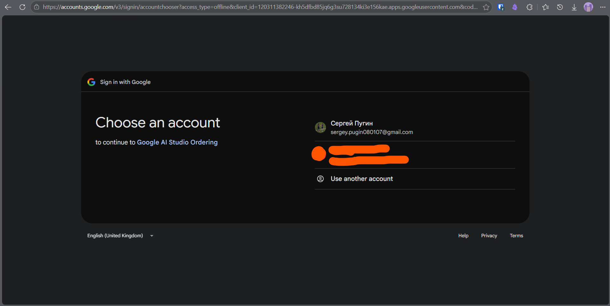
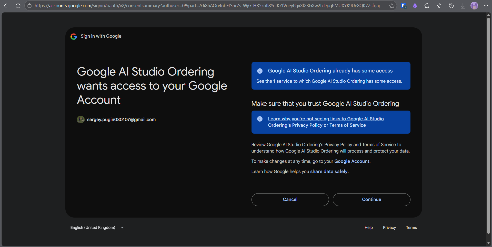
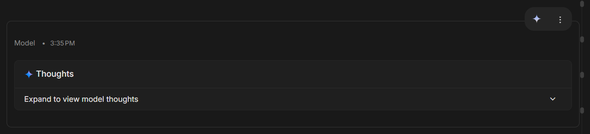

В этом репозитории Вы сможете найти наиболее эффективный способ работы с `Google AI Studio`: благодаря использованию скрипта `Google AI Studio Reordering` в Вашем гугл диске появятся новые md-заметки - сконвертированные чаты, которые Вы всегда можете скачать, отредактировать и/или передать другому ИИ-вендору.

Так что теперь Вы сможете решать, что ИИ будет помнить, а что нет.


Цель одна - экспорт чатов. Как это сделать? Есть два пути:
1. Если Вам нужно экспортировать пару чатов, то используйте следующую инструкцию: [экспорт через загрузку чатов](Colab_way.md)
2. Если же Вы хотите экспортировать все чаты, рассортировать аттачменты в папке `Google AI Studio` по папкам, иметь возможность находить неиспользуемые файлы и Вы готовы предоставить скрипту доступ к редактированию Вашего гугл диска, то прочитайте этот `README`.

К прочтению считаю обязательным следующие пункты:
1. [До / После](#до--после)
2. [Подводные камни](#подводные-камни)
3. [Быстрый старт](#быстрый-старт)
4. [Автоматизация через `config.json`](#автоматизация-через-config.json)


Больше технических подробностей Вы сможете найти тут: [TECHNICAL](TECHNICAL.md)

# Google AI Studio и цель скрипта


[`Google AI Studio`](https://aistudio.google.com) - интерфейс для работы с `Gemini` в самом сыром виде. Ваши чаты не кэшируются, из-за чего в каждом чате память всегда идеальная, но быстро кончающаяся: Вы всегда видите, сколько токенов задействуется в чате, но это число никак не будет уменьшаться (только если Вы удалите аттачменты или запросы/ответы чата вручную).

>[!important]
>Интересно, что все чаты, а также прикрепляемые в них файлы хранятся на Вашем гугл диске в автоматически создающейся папке `Google AI Studio`. Причём именно в корне диска. При перемещении любых файлов из этой папки ничего не ломается, т.к. студия работает через `id` файлов, из-за чего студии важно лишь одно: файл не должен быть удалён. А если Вы переместите  саму папку, то студия создаст в корне новую.

Тут Вы сможете скачать скрипт, цель которого - автоматическая сортировка, конвертация в markdown и очистка хранилища `Google AI Studio`. Его Вы можете найти справа, в разделе `Releases`.

# До / После

Чтобы легче было объяснять работу скрипта, рассмотрим пример. Пусть у Вас есть два чата: `Learning JAVA` и `GitHub Callouts`. Тогда в Вашей папке `Google AI Studio` древо файлов будет выглядеть так:
```text
Google AI Studio/
├── GitHub Callouts
├── history.md
├── lab1.java
├── Learning JAVA
├── lection1.pdf
├── lection2.pdf
├── trash.json
└── useless.py
```

Думаю, Вы согласитесь, что тут мало что понятно. Однако после применения скрипта древо файлов будет таким:
```text
Google AI Studio/
├── _Trash/
│   ├── trash.json
│   └── useless.py
├── Chats/
│   ├── GitHub Callouts/
│   │   ├── Attachments/
│   │   │   └── md/
│   │   │       └── history.md
│   │   ├── GitHub Callouts.md
│   │   └── GitHub Callouts
│   └── Learning JAVA/
│       ├── Attachments/
│       │   ├── java/
│       │   │   └── lab1.java
│       │   └── pdf/
│       │       ├── lection1.pdf
│       │       └── lection2.pdf
│       ├── Learning JAVA.md
│       └── Learning JAVA
└── _map.json
```

Таким образом, Вы можете увидеть все возможные изменения, которые будут с папкой:
1. Создание `_map.json` в корне
2. Создание папки `_Trash` и/или `Chats` в корне
3. Создание папки `Title` для чата `Title`
4. Создание файла `Title.md` для чата `Title`
5. Создание папки `Attachments` внутри папки `Title` и создание в ней папки `{ext}` для аттачментов чата `Title`
6. Перемещение файлов по созданным папкам

>[!important]
> После выполнения скрипта студия продолжит работать в обычном режиме, а значит продолжит скидывать новые чаты и аттачменты в папку `Google AI Studio` на самый верхний уровень. Благодаря тому, что все обработанные файлы и чаты лежат в папках `_Trash` и `Chats`, а также тому, что `_map.json` начинается с символа `_`, они будут появляться строго снизу (при сортировке в алфавитном порядке).

# Подводные камни

По поводу скрипта:
1. Поскольку очень важно хранить каждый чат в своей папке и не путать аттачменты чатов, было принято следующее решение для чатов с одинаковыми названиями: если у Вас будет `n` чатов с названием `Title`, то скрипт переименует их в `Title`, `Title (1)`, `Title (2)`, ..., `Title (n-1)`. Для аттачментов и прочих файлов это правило не распространяется.
2. Поскольку md-заметки чатов будут зачастую скачиваться и/или читаться в `Obsidian`, необходимо избежать следующих символов в их названии: `<>:"/\\|?*`. В связи с этим было принято решение переименовывать чаты, содержащие эти символы: эти символы будут просто удалятся из названий. Вроде бы ничего такого, но после запуска скрипта в Вашей истории всплывёт может 5, может 10 чатов из далёкого прошлого, т.к. зачастую встречаются чаты с `:` в своём названии.
3. Если Вы использовали чат студии для генерации изображений, то те изображения, которые студия создаст, проигнорируются. Сделано это для упрощения логики, которая и так нелёгкая.

По поводу студии:
- Гугл очень хитро придумал, что каждый чат или строка задаётся именно своим уникальным `id`!
- Все чаты, а также прикрепляемые в них файлы хранятся на Вашем гугл диске в автоматически создающейся папке `Google AI Studio`. Причём именно в корне диска. 
- При перемещении любых файлов из этой папки ничего не ломается, т.к. студия работает через `id` файлов, из-за чего студии важно лишь одно: файл не должен быть удалён. А если Вы переместите саму папку, то студия создаст в корне новую и начнёт туда складывать все новые чаты и аттачменты.

# Проблематика и ценность скрипта
## 1. Автоматическая сортировка

К сожалению, студия довольно лениво работает со всеми файлами: она их просто сбрасывает в ту папку `Google AI Studio` на Вашем диске. Многие пользователи пытаются руками создавать папки для чатов, пытаются перемещать все аттачменты внутрь той папки, но после нескольких минут монотонной работы бросают это дело.

Я постарался решить проблему абсолютного хаоса и сделал скрипт, который будет "прибираться" в этой папке.

## 2 Конвертация в markdown

Почему этот формат? Потому что существует его очень удобный редактор `Obsidian`. 

Подробнее: [sergeypugin/obsidian-guide](https://github.com/sergeypugin/obsidian-guide)

>[!note]
> Не менее важной причиной, побудившей меня сделать этот скрипт, стало желание иметь базу знаний из чатов в `markdown`. Скрипт позволит без проблем передать новому чату или любой другой платформе ИИ Ваш так называемый "контекст". Для продолжения работы любого чата, например, того же `Learning JAVA`, Вам достаточно в новый чат любого ИИ-вендора (будь то `Chat GPT` или просто другой аккаунт `Google AI Studio`) переместить md-файл и аттачменты, которые Вы посчитаете полезными. Максимально бесшовный переход!
>>[!important]
>>ВАЖНО: файлы, которые Вы прикрепляли через гугл диск, никуда не перенесутся, останется лишь ссылка на них в заметке.

Конвертация чата в заметку, казалось бы, задача лёгкая, т.к. файл чата - это обычный `json`. Однако встаёт вопрос о том, как сохранять те аттачменты, что Вы прикрепляете по ходу диалога. Решением было выбрано создавать в чате на местах вставки аттачментов такие таблицы:

| Attachment | ID  | Local Link                                                       | Web Link                                    |
| ---------- | --- | ---------------------------------------------------------------- | ------------------------------------------- |
| Тип файла  | id  | `[Attachments/ext/file_name.ext](Attachments/ext/file_name.ext)` | `https://drive.google.com/file/d/{ID}/view` |

Пройдёмся по каждому столбцу:
1. Тип - это обычно `driveImage`, `driveDocument` и т.п.
2. id на гугл диске - уникальная строка, создающаяся для каждого файла
3. Локальная ссылка - для Obsidian: будет удобно при работе с заметкой.
4. Ссылка на гугл драйв, чтобы можно точно было определить файл.

После работы скрипта на Вашем гугл диске будут видны все Ваши чаты, разложенные по папкам, которые названы точно так же. Т.е. условный чат `Learning JAVA` Вы можете найти, перейдя в папку `Google AI Studio/Chats/Learning JAVA`, имеющую следующую структуру:
```text
Learning JAVA/
       ├── Attachments/
       │   ├── java/
       │   │   └── lab1.java
       │   └── pdf/
       │       ├── lection1.pdf
       │       └── lection2.pdf
       ├── Learning JAVA.md
       └── Learning JAVA
```

Вы можете увидеть а) заметку чата б) папку со всеми прилагаемыми этому чату аттачментами, рассортированными по типам (очень удобно разделять скриншоты `png` / `jpeg` от, например, отчётов / презентаций `pdf` или кода `java`, `py` и т.д.).


## 3. Очистка хранилища Google AI Studio

После того, как Вы загрузили любой файл в студию, интерфейс автоматически загружает этот файл в гугл диск и просто берёт его id. После удаления аттачментов из чата студии или удаления самого чата диск не чистится, что приводит к огромному кол-ву файлов, которые никем не используются и занимают немало места на гугл диске.

Эти скрытые файлы будут скриптом перемещены в `Google AI Studio/_Trash` и Вы сможете все их найти и удалить.

## 4. Back Up

Если вдруг студия Вас забанит / перестанет работать в РФ или ещё что, то у Вас останутся все чаты и все аттачменты.

А если Вы ещё и боитесь блокировки гугл диска, то Вам достаточно настроить mirroring в гугл диске. Тогда все данные будут храниться у Вас локально!

# Быстрый старт

Хоть заголовок и `Быстрый старт`, при первом выполнении скрипта может уйти порядка 10-15 минут. При последующих же - уже около минуты, т.к. скрипт уже знает, какие чаты он обрабатывал. При повторном запуске Вы вряд ли успеете создать более десятка чатов.

>[!note]
> Чтобы скачать приложение/скрипт, найдите справа `Releases` и скачайте zip-архив.
> 
> После распаковки в удобное Вам место Вы получите такую структуру:
> ```text
> Google_AI_Reordering/
> ├── data/
> │   └── credentials.json
> └── Google_AI_Studio_Reordering.exe
> ```
> Тут же, в `data`, появится `app.log` после первого запуска программы.
> 
>  Теперь просто кликните на `Google_AI_Studio_Reordering.exe` и скрипт запустится!
> >[!important]
> > Рекомендуется на время выполнения скрипта закрыть волты `Obsidian`, если вдруг они содержат папку `Google AI Studio`, т.к. работа с файлми этих волт осуществляется вне `Obsidian`. После выполнения скрипта откройте эти волты, и Вы увидите все изменения! 

Теперь, после наглядного примера, думаю можно рассказать, что делает скрипт. В нём есть ***3 логические ступени***:
1. Аутентификация через гугл (создаётся токен в файл `token.json`)
2. Выбор режима работы
3. Выполнение работы

***Режимы:***
1. Рассортировать файлы по папкам, как было сделано на примере с `Learning JAVA` и `GitHub Callouts`
2. Переместить все файлы в `Google AI Studio`
3. Завершить программу

После запуска скрипта у Вас откроется ссылка с просьбой войти в аккаунт 


Затем Вас спросят, готовы ли Вы предоставить приложению доступ. Нажмите `Continue`  


>[!important]
> Да, от Вас требуются права на редактирование Вашего гугл диска. Казалось бы, что теперь скрипт сможет упрятать Ваши файлы или удалить их. Однако:
> 1. Скрипт не вылезает за рамки папки `Google AI Studio`: он может максимум посмотреть данные о файле из диска, который Вы когда-то прикрепляли в студию через диск
> 2. Скрипт ничего и никогда не удаляет, у него нет просто функции - удалить! Вместо того, чтобы бесполезные файлы удалять, он переносит их в `Google AI Studio/_Trash`, где Вам предоставляется возможность увидеть все папки и файлы, которые не нужны ни одному чату. Право удалять предоставляется Вам.

>[!note]
> Также после того, как Вы нажмёте `Continue`, к Вам на почту придёт письмо или даже два с пометкой `Security Alert` о том, что Вы дали доступ к гугл диску. Это нормально, т.к. Вы это только что и сделали. 

Затем вернитесь в окно терминала с самим приложением и выберите режим:
1. Запустить уборку
2. Вернуть всё на круги своя (т.е. вытряхнуть обратно всё в папку`Google AI Studio`, все папки не потеряют иерархию, но будут перемещены в `Google AI Studio`/`_Trash`)
3. Завершить программу

Далее, если Вы выбрали режим уборки, Вас попросят подтвердить план переноса. Сделайте это и подождите минут 10-15.

Также Вас спросят, нужно ли сохранять `thinking` чатов. Если что, это про вот эти блоки: 


Советую написать 2, т.е. не сохранять эти блоки в заметки, т.к. в среднем они занимают треть заметки, а ничего существенного важного в себе не несут.

Готово! Вся структура достигнута!

>[!important]
>Может показаться, что раз теперь Вы видите все аттачменты чата в папке `Attachments`, то достаточно удалить её (и из Bin в гугле тоже), и кол-во токенов в чате уменьшится. И Вы правы. ОДНАКО: чат после удаление любого аттачмента чат студии не заработает! И единственный способ будет его продолжить - это удалить руками в чате все те аттачменты, что были удалены с диска. Ну или сделать md-заметку при помощи скрипта и работать уже с ней.
>
>Так что ни в коем случае не удаляйте аттачменты вне интерфейса студии!!!
>
>Что Вы можете удалять, так это целую папку чата: так Вы удалите не только чат, но и его заметку и все его аттачменты. Однако если Вы удалите чат через студию, то скрипт со своим сборщиком мусора сам переместит папку чата в `_Trash`, которую очистить сможете только Вы

Если Вы не хотите её терять (или хотите обновление md-файлов после обновления чатов), можете запускать скрипт повторно (раз в день или чаще) - он рассчитан на такие сценарии. Скрипт создаст в папке `Google AI Studio` файл `_map.json`, чтобы отслеживать, какими чатами он уже занимался. Время выполнения скрипта, разумеется, теперь будет меньше: обычно не более минуты.

# Управление чатами

>[!important]
> Открывать папку `Google AI Studio` как `Vault` нельзя ни в коем случае! Системная папка `.obsidian` при запуске скрипта перенесётся в `_Trash`, из-за чего в `Obsidian` случится нечто непоправимое... 
> 
> Поэтому выбирайте целый гугл диск для `Vault` или прочих папок-родственников.

Теперь, когда Вы сконвертировали все чаты в заметки и сгрупировали все аттачменты по папкам, можете открыть свой `Obsidian` для просмотра этих папок и заметок. Советую попробовать `bases` от `Obsidian`. Про работу с `bases` можете прочитать тут: [obsidian-bases.md](https://github.com/sergeypugin/obsidian-guide/blob/main/guides_for_ai/obsidian-bases.md), но скорее всего Вам хватит блока кода ниже, который довольно универсален.

>[!note]
>Пользоваться `bases` можно либо создав `file_name.base`, либо `file_name.md`, в котором будет блок кода с "```base". Второй вариант имеет преимущество: редактировать код базы Вы можете не выходя из `Obsidian`, а также можете писать свои заметки в этом md-файле под и над этой базой, что мне кажется очень удобным.

Можете вставить в любую заметку следующее содержимое:
````
```base
properties:
  note.type:
    displayName: note.type
  file.name:
    displayName: ссылка на md
  note.web-session:
    displayName: web-ссылка
  note.title:
    displayName: заголовок
views:
  - type: table
    name: Studio Chats
    filters:
      and:
        - type == "ai-studio-session"
    order:
      - title
      - file.name
      - web-session
      - last_active
    sort:
      - property: last_active
        direction: DESC
```
````

После вставки нажмите `Ctrl + E` (переключитесь в режим чтения). Вот и таблица!

Этот блок кода как и Mermaid молниеносно превращается в динамическую графику (в данном случае таблицу, где будут столбцы `заголовок | ссылка на md | web-ссылка`). У такой базы есть ряд преимуществ:
1. ***Вы видите все Ваши чаты*** они отсортированы по дате обновления (можете кликнуть на любой столбец и сортировка будет по нему)
2. ***Легко удалить чат / аттачменты*** кликните по ссылке на заметку. Она автоматически найдётся, `Obsidian` Вам покажет, в какой папке она находится. Далее Вы можете удалить либо аттачменты, либо весь чат целиком (в мусоре гугл диска он будет храниться ещё 30 дней)
3. ***Ссылки на гугл*** подтягиваются из свойств заметок

Если Вам нужно сортировать свои чаты по группам, то пока это возможно лишь при помощи анализа имён чатов:
1. Создайте новый вид (`add view`)
2. При помощи фильтров кажите, какие слова должны быть в названии чата, чтобы заметка чата появилась в таблице

# Автоматизация через `config.json`

> [!tip]
> Чтобы не выбирать режимы работы скрипта всякий раз, можете расположить в `data` файл `config.json` со следующим содержимым:
> ```json
> {
>   "mode": "1",
>   "include_thoughts": false,
>   "auto_confirm": true
> }
> ``` 
> Поля Вы можете изменять. Назначения:
> - `mode` для выбора режима
> - `include_thoughts` для сохранения `Thinking` моделей (обычно бесполезны)
> - `auto_confirm` для подтверждения списка запросов по внесению изменений на Вашем гугл диске
> 
> ВАЖНО: после завершения скрипта окно закроется, так что у Вас ограниченное время на просмотр того, что пишет в консоль скрипт.
> 
> Однако всегда есть возможность заглянуть в создавшийся в папке `data` файл `app.log`, в котором хранится информация, выводившаяся в консоль, для каждого запуска

# Интеграция с плагином Obsidian `Gemini Scribe`

Подсмотрев краем глаза в плагин для `Obsidian` [Gemini Scribe](https://github.com/allenhutchison/obsidian-gemini/), я выбрал очень похожий формат сохранения чата. Самое интересное то, что совершенно случайно произошло после запуска скрипта: чат студии, сконвертированный в markdown, при переносе в системную папку `gemini scribe/Agent Sessions` плагина превращается в чат плагина, который Вы беспрепятственно можете продолжить! Так что этот скрипт является ещё и способом переезда в `Obsidian` с использованием `Gemini Scribe` (он может работать не только по `API` из студии, но и с локальной `Ollama`, что многим пользователям может оказаться полезно).